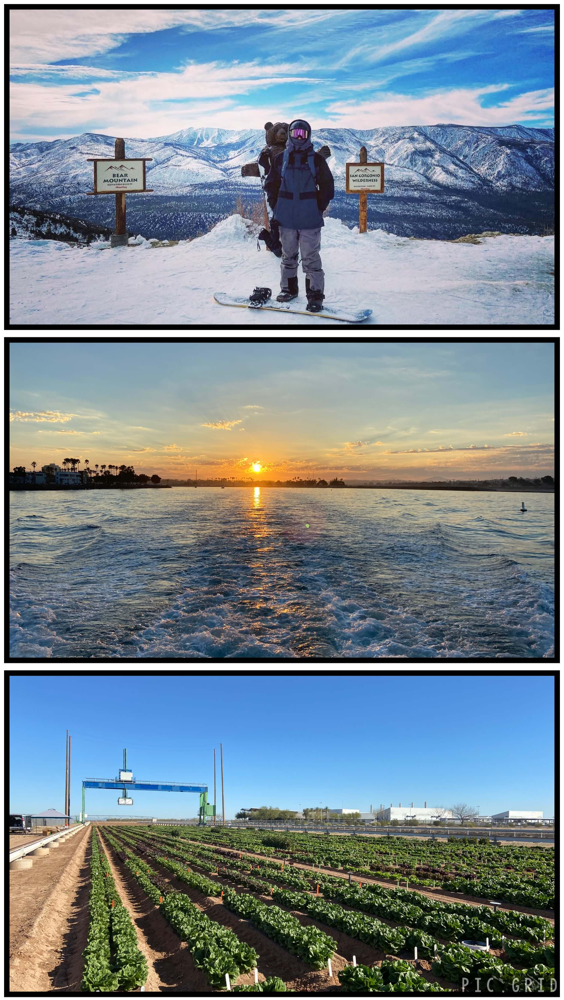

<html lang="en">
<head>
    <meta charset="UTF-8">
    <meta name="viewport" content="width=device-width, initial-scale=1.0">
    <title>Medina, J.</title>
    <link rel="stylesheet" href="styles.css">
    
</head>
<body>
    
    <header>
        <nav>
            <ul>
                <li><a href="#home">Home</a></li>
                <li><a href="#about">About</a></li>
                <li><a href="#sinyapps">ShinyApps</a></li>
                <li><a href="#contact">Contact</a></li>
                <li><a href="Medina_Justin_Resume.pdf" id="resume-link" target="_blank">Resume</a></li>
            </ul>
        </nav>
    </header>

    <main>
        <article id="home">
        

            

                <!-- Text content on the left -->
                <h1>Justin R. Medina</h1>
                
Applied Biostatistics, Data Analytics, & Statistical Programming Professional.

                
"Turning data into insights is my passion."

                <button class="projects-button"><a href="#my-projects">My Projects</a></button>
            

        

            

                
                

                

            

        </article>

        <article id="about">
    

        

            <!-- Text content on the left -->
            <h1>About Me</h1>
            

        

        

            

                
                

                

            

        </article>

       <article id="my-projects">
            <h2>My Projects</h2>
            
            

                

                    

                        
                        
                        
                    

                    
Power BI report to visualize product status in product development pipeline

                

                

                    

                        
                        
                    

                    
Paginated reports using Power BI Report Builder & R Markdown

                

                

                    
                    
Web based data visualization/analysis tools using R Shiny

                

                

                    
                    
Description for Project 4

                

                

                    
                    
Description for Project 5

                

                

                    
                    
Description for Project 6

                

            

        </article>
        

        <article id="contact">
            <h2>Contact Section</h2>
            <!-- Content for the contact section -->
        </article>
  </main>

    <footer>
        
&copy; 2024 J. Medina's Data Portfolio. All rights reserved.

    </footer>
</body>
</html>
